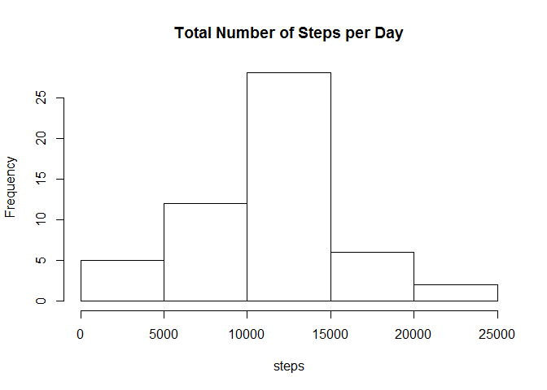
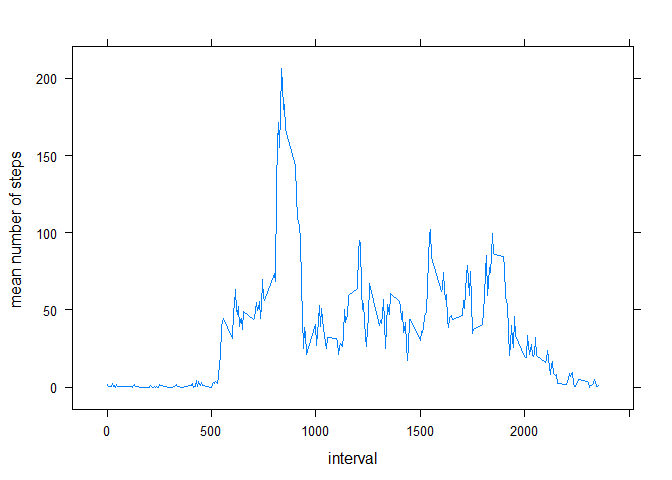
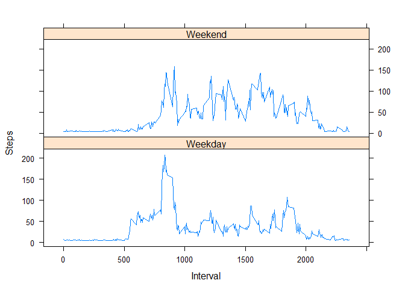

# Reproducible Research: Peer Assessment 1


## Loading and preprocessing the data


```r
setwd("C:/Users/Sotero/Documents/AWC Laptop/RR/Week2/PA_1/RepData_PeerAssessment1")

activity <- read.csv("activity.csv" , header= T  )


tsd <- tapply(activity$steps,activity$date,sum)

# total number of steps for each day

tstepsday <- data.frame(date = names(tsd),steps = tsd   )


rownames(tstepsday) <- 1:61
```


## What is mean total number of steps taken per day?

1. Make a histogram of the total number of steps per day


```r
hist(tstepsday$steps, xlab = "steps", main = "Total Number of Steps per Day" ) 
```

 


2. Calculate and report the mean and median total number of steps per day

mean number of steps


```r
meansteps <- mean(tstepsday$steps,na.rm=TRUE)

meansteps
```

```
## [1] 10766.19
```

median number of steps


```r
mediansteps <- median(tstepsday$steps,na.rm=TRUE)

mediansteps
```

```
## [1] 10765
```

## What is the average daily activity pattern?


1. Make a time series plot(i.e. type="l") of the 5-minute interval (x-axis) and the avarage number of steps taken, averaged across all days (y-axis)


```r
intstep<-tapply(activity$steps,activity$interval,mean,na.rm=T  )

isp <- data.frame(interval= names(intstep),step= intstep  )


rownames(isp) <- 1:288

isp$interval <- as.character(isp$interval  )

isp$interval <- as.integer(isp$interval)

library("lattice", lib.loc="C:/Program Files/R/R-3.1.1/library")
library("latticeExtra", lib.loc="~/R/win-library/3.1")
```

```
## Loading required package: RColorBrewer
```

```r
xyplot(isp$step~isp$interval,xlab="interval",ylab="mean number of steps ",type="l")         
```

 


2. Which 5-minute interval, on avarage across all days in the dataset, contains the maximum number of steps


```r
maxindex<-which.max(isp$step)


mi<-max(maxindex)


isp$interval[mi]
```

```
## [1] 835
```


## Imputing missing values

1. Calculate the total number of missing values in the dataset (i.e. the total number of rows with NAs)


```r
logina<-is.na(activity$steps)


table(logina)["TRUE"]
```

```
## TRUE 
## 2304
```

```r
naindex <- grep(T,logina)

activity1<-activity


# mean number of steps for each day
msd <- tapply(activity$steps,activity$date,mean,na.rm=T)

mstepsday <- data.frame(date = names(msd),steps = msd   )


rownames(mstepsday) <- 1:61


# here we replace the na steps with the day average if it exits

for( i in naindex){
  
           activity1$steps[i]<-mstepsday$steps[ceiling( i /288 )]
    
  
        }

# here we replace na values for which there are no day average with the overall average of
# the total number of steps per day divided by the 288 5 minute intervals for the day

activity1$steps <- as.integer(sub(NaN,meansteps/288,activity1$steps ))

## here we recalculate the total steps


tsd1 <- tapply(activity1$steps,activity1$date,sum)

# total number of steps for each day

tstepsday1 <- data.frame(date = names(tsd1),steps = tsd1   )
```

mean number of steps after replacing na's is


```r
meansteps1<-mean(tstepsday1$steps,na.rm=TRUE)

meansteps1
```

```
## [1] 10751.74
```
The mean number of steps without replacing na's is


```r
meansteps
```

```
## [1] 10766.19
```


############
The median number of steps after replacing na's is


```r
median(tstepsday1$steps,na.rm=TRUE)
```

```
## [1] 10656
```


The median number of without replacing na's is 


```r
mediansteps
```

```
## [1] 10765
```


Both means are very close. The medians are not as close.


## Are there differences in activity patterns between weekdays and weekends?


```r
 activity1$date <- as.Date(activity$date,format="%Y-%m-%d")


dayofweek <- weekdays(activity1$date)

# wnk is weekend on non weekend

wnw <- as.factor(ifelse(dayofweek %in% c("Saturday","Sunday"), "Weekend", "Weekday")) 


activity1 <-cbind(activity1,wnw )


## here we separete the week day from weekend data

weekdaysteps <- activity1[activity1$wnw == "Weekday",  ]

weekendsteps <- activity1[activity1$wnw == "Weekend",   ]

## here we compute the average for each interval for the week

weekdayave <- tapply(weekdaysteps$steps,weekdaysteps$interval,mean,na.rm = T)


weekdayave <- data.frame(interval = names(weekdayave),steps = weekdayave   )


fwd <- rep("Weekday",288)

weekdayave <- cbind(weekdayave,fwd )


colnames(weekdayave)[3] <- "day.type"


### here we compute the average for each interval for the weekend

weekendave <- tapply(weekendsteps$steps,weekendsteps$interval,mean, na.rm = T)


weekendave <- data.frame(interval=names(weekendave),steps = weekendave    )


fwe <- rep("Weekend",288  )


weekendave <- cbind(weekendave,fwe   )

colnames(weekendave)[3] <- "day.type"


## here we combine the two files

activityweek <- rbind(weekdayave,weekendave)


activityweek$day.type <- as.factor(activityweek$day.type)


activityweek$interval <- as.character(activityweek$interval)


activityweek$interval <- as.numeric(activityweek$interval)


activityweek$steps <- as.numeric(activityweek$steps)

xyplot(steps ~ interval | factor(day.type),data = activityweek, xlab = "Interval", ylab = "Steps",
       layout = c(1,2)  ,type="l")
```

 

```r
str(activityweek)
```

```
## 'data.frame':	576 obs. of  3 variables:
##  $ interval: num  0 5 10 15 20 25 30 35 40 45 ...
##  $ steps   : num  6.96 5.33 5.09 5.11 5.02 ...
##  $ day.type: Factor w/ 2 levels "Weekday","Weekend": 1 1 1 1 1 1 1 1 1 1 ...
```

```r
## here we recalculate the total steps


#tsd1 <- tapply(activity1$steps,activity1$date,sum)

# total number of steps for each day

#tstepsday1 <- data.frame(date = names(tsd1),steps = tsd1   )
```


